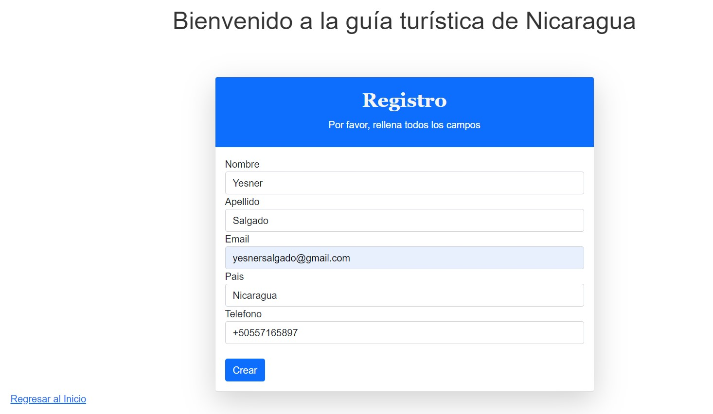
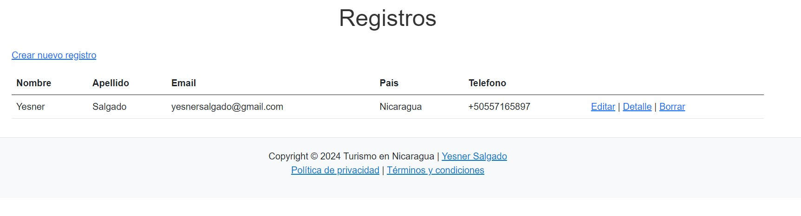
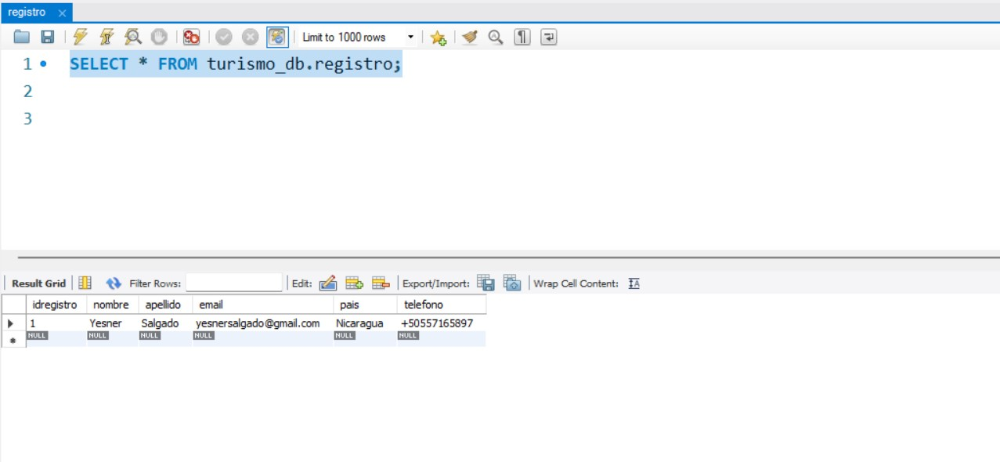

# Trabajo Práctico PC3 y .Net 6 💻
## Description 📚
- Aplicación Web de ASP.NET Core MVC
- Lenguaje de programación C♯
- Base de datos en MySQL Workbench 8.0.34
- NuGet Packages: Microsoft.EntityFrameworkCore.Tools 6.0.28, Pomelo.EntityFrameworkCore.MySql 6.0.2
- Generar controller: Scaffold-DbContext "server=xxxx; port=xxxx; database=xxxx;uid=xxxx;password=xxxx;" Pomelo.EntityFrameworkCore.MySql -o Models
 
## Frontend Development  

   

### La interfaz gráfica de usuario

### Formulario de registro

### Registro Almacenado

## Backend Development  
 
  

 ### Registro en Base de Datos

 